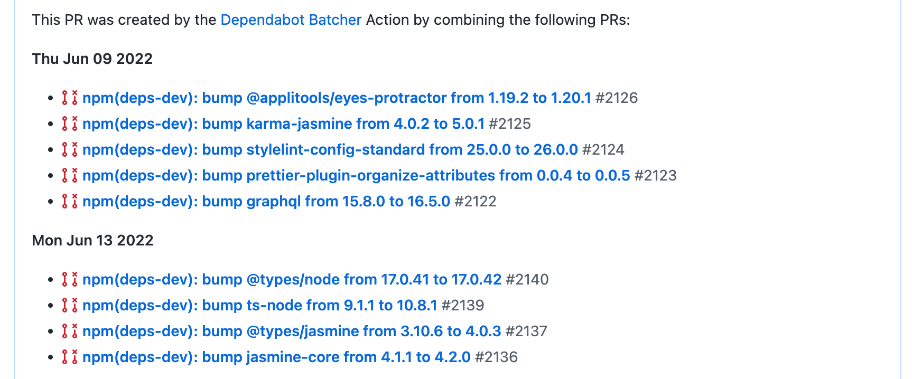

# Dependabot Batcher

An action to ease your dependency maintenance and save GitHub minutes.

Dependabot is great - it alerts you to vulnerable and outdated dependencies and even creates PRs to update them.
However, it can often create multiple PRs a day, all of which consume valuable GitHub minutes in your CI pipeline.

Moreover, reviewing them and managing your dependencies can soon become extremely time-consuming, not to mention that it
pollutes your Pull Requests page.

Some of our teams using this action internally have reported saving almost a week of maintenance time every month!

## What does it do?

Dependabot Batcher will automatically merge all your Dependabot PRs into one. The PR that it creates provides links to
the original PRs, which are then closed and assigned a `dependabot-batched` label. This allows you to turn off your CI
checks for Dependabot PRs, only running them on the PR that Dependabot Batcher creates for you.

If you haven't merged the batch PR when it next runs, it'll automatically append the new additions.



## Usage

### Configuration

| input              | description                                                                                                                | required | default |
|--------------------|----------------------------------------------------------------------------------------------------------------------------|---|------------------------------|
| `token`              | A token with 'repo' and 'workflow' privileges                                                                              | ✅ | N/A |
| `baseBranchName`     | The name of your default branch, usually `main` or `master`                                                                |   | `'main'` |
| `batchBranchName` | The name to give the branch containing your batched dependencies. [Cannot start](#important-information) with `dependabot` |   | `'batched-dependabot-updates'` |
| `batchPullTitle`  | The title to give the PR containing your batched dependencies                                                              |   | `'Batched Dependabot updates'` |

### Implementation

First, create a new workflow that runs this action on a schedule. Use a `cron` setting suitable for your needs; we
typically run this twice a week as can be seen in the example below. You can run it more often, but there is little
point unless you plan to merge the generated PR more often than that, since you'd only be consuming more GitHub
minutes on your PR pipeline every time it updates the generated PR.

```yml
name: 'Dependabot Batcher: Scheduled'
on:
  schedule:
    - cron: '0 9 * * 1,3'

jobs:
  # Batches Dependabot PRs into one by merging them into a combined branch, then raising a new PR
  dependabot-batcher:
    name: 'Combine Dependabot PRs'
    uses: Legal-and-General/dependabot-batcher
    token: ${{ secrets.YOUR_TOKEN }} #required
    baseBranchName: 'master' #optional
    batchBranchName: 'dep-batcher-updates' #optional
    batchPullTitle: 'Dependabot Batcher Updates' #optional
```

To save your PR pipeline running on every Dependabot PR (since the checks will run on the Dependabot Batcher PR), we
need to exclude the jobs from running on branches that Dependabot raises. Apply the `if` statement below to any jobs you
don't wish to run:

```yml
name: 'Pull Request'

on:
  pull_request:
    types: [ opened, synchronize ]

jobs:
  someJob:
    if: ${{ !startsWith(github.head_ref, 'dependabot/') }}
```

### Important information

⚠️ This Action searches for branch names that start with `dependabot` since that is the Dependabot branch naming
strategy. As such, ensure that the `batchBranchName` input does not begin with `dependabot`.

ℹ️ When the Action is unable to merge a Dependabot PR, it will keep the original PR open. This usually happens when
there are updates for consecutive dependency entries in your `package.json` file, which cause merge conflicts. Merging
the batched PR will mean it gets picked up on the next run.

You will see the branches that could not be combined in the logs, for example:

```
🚫 These branches could not be combined:
dependabot/npm_and_yarn/nrwl/linter-14.5.1
dependabot/npm_and_yarn/nrwl/eslint-plugin-nx-14.5.1
```
